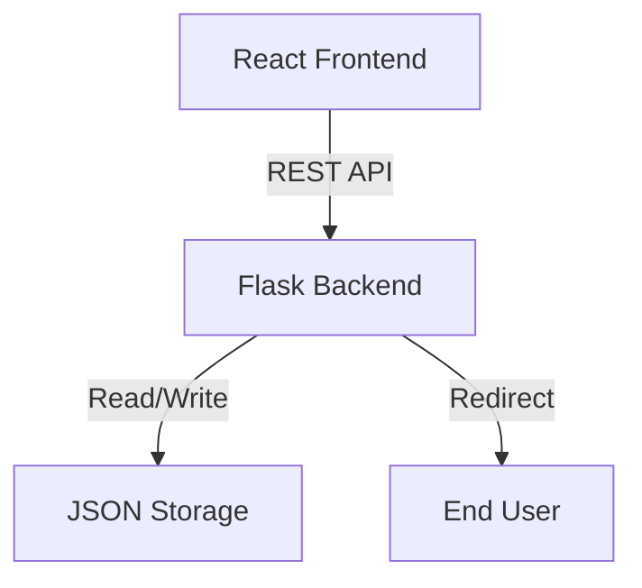

# Professional URL Shortener


A high-performance, full-stack URL shortening service built with Flask and React. Designed for scalability, ease of use, and modern aesthetics.

## Features

- **Instant Shortening**: Convert long URLs into compact, shareable links.
- **Custom Aliases**: Create personalized short codes (e.g., `mysite/offer`).


## Architecture



## Getting Started

### Prerequisites
- Python 3.9+
- Node.js 18+

### Installation

1. **Clone the repository**
   ```bash
   git clone https://github.com/yourusername/url-shortener.git
   cd url-shortener
   ```

2. **Backend Setup**
   ```bash
   cd backend
   python -m venv venv
   # Windows
   .\venv\Scripts\activate
   # Mac/Linux
   source venv/bin/activate
   pip install -r requirements.txt
   ```

3. **Frontend Setup**
   ```bash
   cd frontend
   npm install
   ```

### Running the Application

**1. Start Backend Server**
```bash
cd backend
python app.py
# Server running at http://localhost:5000
```

**2. Start Frontend Client**
```bash
cd frontend
npm run dev
# Client running at http://localhost:5173
```

## API Documentation

### `POST /api/shorten`
Create a new short URL.
**Body:**
```json
{
  "url": "https://example.com/long-url",
  "alias": "optional-alias"
}
```
**Response:**
```json
{
  "original_url": "https://example.com/long-url",
  "short_code": "Ab3d9",
  "created_at": "2023-10-27T10:00:00Z",
  "clicks": 0
}
```

### `GET /<short_code>`
Redirects to the original URL.

### `GET /api/stats/<short_code>`
Get analytics for a short URL.

## Tech Stack

- **Backend**: Python, Flask, Flask-CORS
- **Frontend**: React, Vite, Tailwind CSS, Axios, Lucide React
- **Storage**: File-based JSON (MVP), adaptable to PostgreSQL


---
<h3 align="center">
  <span style="background: linear-gradient(90deg, #ff7ce6, #8b5cf6, #3b82f6); 
               -webkit-background-clip: text; color: transparent;">
    Built with ❤️ by Nivedita
  </span>
</h3>
